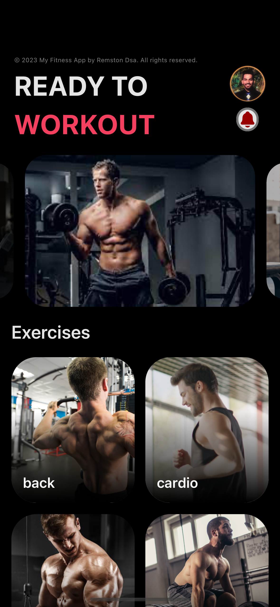

# Fitness App

Welcome to the Fitness App, your personal guide to a healthier and fitter lifestyle. This React Native mobile application is designed to provide users with a comprehensive platform for discovering, learning, and practicing various exercises to meet their fitness goals.

## Features

- **Exercise Database:** Explore a vast database of exercises categorized based on different body parts.
- **Detailed Exercise Information:** Get detailed information about each exercise, including equipment required, secondary muscles targeted, and step-by-step instructions.
- **Customizable Workouts:** Tailor your workout routine by selecting exercises based on your preferences and fitness objectives.
- **Image Slider:** Visualize exercises with a user-friendly image slider to ensure proper form and technique.
- **Responsive Design:** Enjoy a seamless experience on both iOS and Android devices, thanks to the responsive design of the app.

## My App UI
1. Index Page


2. Home Page


3. Exercise Page


4. Exercise Detail


## Project Structure

The project follows a modular structure for better organization and maintainability.
```
📦 fitness-app
├── tsconfig.json
├── api
│   └── exerciseDB.js
├── app
│   ├── _layout.jsx
│   ├── exerciseDetails.jsx
│   ├── exercises.jsx
│   ├── home.jsx
│   └── index.jsx
├── components
│   ├── bodyParts.jsx
│   ├── exerciseList.jsx
│   └── imageSlider.jsx
├── constants
│   └── index.js
├── assets
│   ├── fonts
│   ├── images
│   └── myImage
├── babel.config.js
├── eas.json
├── expo-env.d.ts
├── metro.config.js
├── node_modules
├── package-lock.json
├── package.json
├── README.md
└── tailwind.config.js
```

# Project Overview

## `api`

- **exerciseDB.js:** Module for interacting with the exercise database.

## `app`

- **\_layout.jsx:** Layout component managing the app's navigation structure.
- **exerciseDetails.jsx:** Component displaying detailed information about a specific exercise.
- **exercises.jsx:** Component showcasing exercises based on selected body parts.
- **home.jsx:** Home component providing an overview of the app.
- **index.jsx:** Entry point of the React Native application.

## `components`

- **bodyParts.jsx:** Component for displaying different body parts.
- **exerciseList.jsx:** Component for listing exercises.
- **imageSlider.jsx:** Component for sliding through images.

## `constants`

- **index.js:** Module containing constant values.

## `assets`

- **fonts:** Directory for storing font assets.
- **images:** Directory for storing image assets.
- **myImage:** Directory for storing custom images.

## Running the App

1. Ensure you have [Node.js](https://nodejs.org/) installed.
2. Install [Expo CLI](https://docs.expo.dev/get-started/installation/) globally:

   ```bash
   npm install -g expo-cli
    ```
3. Navigate to the project directory and install dependencies:
```
npm install
```

4. Start the Expo development server:
```
expo start
```
5. Open the Expo Go app on your iOS or Android device and scan the QR code from the Expo CLI to run the app.
## Additional Information

- **tsconfig.json:** TypeScript configuration file.
- **babel.config.js:** Babel configuration file.
- **eas.json:** EAS (Expo Application Services) configuration file.
- **metro.config.js:** Metro bundler configuration file.
- **tailwind.config.js:** Tailwind CSS configuration file.

Feel free to explore and enhance the Fitness App according to your fitness needs! 🏋️‍♂️💪

